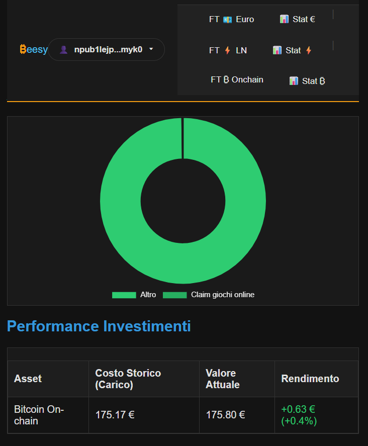

# <strong style="color: #f39c12">₿eesy</strong> - Bitcoin Expense Tracker 🐝⚡

> **"Your Node, Your Rules. Your Data, Your Privacy."**

[](LICENSE)
[](https://github.com/dennj75/beesy/stargazers)

---

## ⚠️ IMPORTANT DISCLAIMER (READ BEFORE USE)

This project is an **EXPERIMENTAL EDUCATIONAL LABORATORY**.

- **NOT** production-ready software.
- **DO NOT** entrust critical financial data to this system without external backups.
- The author is **NOT** responsible for any data loss or security vulnerabilities.
- **PRIVACY:** By running this software locally, your data stays in your SQLite database (`.db`). You are solely responsible for its custody.

---

## 🌟 Key Features
- 📊 **Advanced Analytics [NEW - APRIL 2026]:** Integrated professional dashboards powered by Chart.js. Track your income, expenses, and savings efficiency with real-time visual feedback.
- **📱 Mobile Success & Portability:** Full mobile compatibility tested via ngrok. 100% success rate on mobile database restoration, allowing you to manage your finances on the go without a central server.
- **🔑 Nostr Native Auth:** 
  - **Desktop:** Password-less login via NIP-07 extensions (Alby, nos2x).
  - **Mobile:** Experimental login via Amber (Nostr Signer) on Android using the intent protocol.
- ⚡ **Lightning & On-Chain:** Separate management for Satoshi-precision transactions.
- **🛡️ Military-Grade Backup System:** Encrypted exports using AES-256-GCM. Your data is protected by a Master Key derived from your password.

---

## 📸 Screenshots
| Dashboard | Analytics |
| :---: | :---: |
|  |  |

### 🛠️ TechStack

| Component | Technology | Role |
| :--- | :--- | :--- |
| **Backend** | Flask (Python) | Server-side logic & API management |
| **Data Viz** | **Chart.js** | Interactive bar and doughnut charts |
| **Database** | SQLite | Local-first, private data storage |
| **Security** | AES-256-GCM | Industry-standard encryption for backups |
| **Auth** | Nostr (Amber/NIP-07) | Decentralized, password-less authentication |
| **Dev Method** | **Vibe Coding** | Building with passion and real-time iteration |

---
## 🚀 Quick Start (Self-Hosted)

### 1. Prerequisites

- Python 3.9+
- [Visual Studio Code (VSC)](https://code.visualstudio.com/) recommended.
- Active internet connection (for BTC price APIs).

### 2. Setup

```bash
git clone [https://github.com/dennj75/beesy.git](https://github.com/dennj75/beesy.git)
cd beesy

Create and activate the virtual environment
python -m venv .venv
# Su Windows:
.venv\Scripts\activate
# Su Linux/Mac:
source .venv/bin/activate

Install dependencies and launch
pip install -r requirements.txt
python app.py

```

Access <strong style="color: #f39c12">₿eesy</strong> at http://localhost:5000.

## 🧪 "Nostr" & Mobile Laboratory

⚡ Nostr Authentication: The Magic of Amber
<strong style="color: #f39c12">₿eesy</strong> leverages the power of the Nostr protocol to provide a secure, password-less experience.

Desktop: Use any NIP-07 browser extension (like nos2x or Alby).

Mobile (Amber): On Android, <strong style="color: #f39c12">₿eesy</strong> triggers an Android Intent. Amber pops up, you approve the signature, and you are logged in. Your private key never touches our code.

## 🔏 The "Privacy-First" Laboratory

🛡️ Backup & Restore
We implemented a robust backup system to ensure you never lose your data:

- Traditional Users: Your backup is encrypted using a Master Key derived from your password. Even if someone steals your backup file, they cannot read it without your Beesy password.
- Nostr Users: Quick JSON export/import for seamless identity portability.
  -Mobile Ready: Restore your history directly from your smartphone browser with 100% success rate on traditional accounts.

## 🛠️ Roadmap & Contributions


- [x] **Encrypted Backup & Restore:** Fully functional on PC and Mobile.
- [x] **Advanced Analytics:** Real-time visual dashboards (Chart.js).
- [x] **Plug & Play DB:** Automatic database and table creation on first run.
- [ ] **Multi-currency support:** Beyond EUR (USD, CHF, etc.).
- [ ] **Multi-language Support (i18n):** Translating the interface into English to reach the global Bitcoin community. 🌍
- [ ] **Detailed History:** Transaction drill-down within the Analytics page.
- [ ] **Docker Support:** One-click deployment for Umbrel/Raspberry Pi.

---

## 👨‍💻 Behind the Code: A "Vibe Coding" Story

This project is a labor of love by a **self-taught developer**. 
- **Learning by doing:** ₿eesy is my first major project shared on GitHub.
- **Bitcoin in my heart:** I built this because Bitcoin is a fundamental part of my journey.
- **Vibe Coding:** I believe in building software that feels right, iterating quickly, and learning through the "vibe" of the development process.

---

## 💜 Connect on Nostr

If you want to follow the development or get in touch in a decentralized way:

- **Developer (@Dennj75):** [dennj75@nostr.red](https://primal.net/p/npub1lejpu7ms5j6y7srv32ndxw4m9j5vp7tgdjpsxw32h3r2y7zpqtdsdumyk0) 
  - `npub1lejpu7ms5j6y7srv32ndxw4m9j5vp7tgdjpsxw32h3r2y7zpqtdsdumyk0`
- **Beesy Project:** [beesy@nostrcheck.me](https://primal.net/p/npub1k8dfux202k788vm955rn4wrckvavuxxr3202wlpsa2h97d4tlkrsp57qcv)
  - `npub1k8dfux202k788vm955rn4wrckvavuxxr3202wlpsa2h97d4tlkrsp57qcv`

---

## 🇮🇹 Versione Italiana

<strong style="color: #f39c12">₿eesy</strong> è un tracker di spese "Bitcoin-first" progettato per la privacy totale.
<strong style="color: #f39c12">₿eesy</strong> è un tracker di spese "Bitcoin-first" progettato per la privacy totale.

- **Analytics Avanzate:** Grafici interattivi (in tempo reale per Bitcoin Onchain e Lightning) per monitorare entrate, uscite e tasso di risparmio.
- **Backup Cifrato:** Esporta i tuoi dati in formato AES-256 sicuro.
- **Senza Password:** Prova il login Nostr tramite estensioni browser o Amber su Android.

- **Ripristino Mobile:** Funzionante al 100% per account tradizionali.

- **Senza Password:** Prova il login Nostr tramite estensioni browser o Amber su Android.

---

| <strong style="color: #f39c12">₿eesy</strong> | Building in public 🚀 | Stay humble, stack sats ⚡
